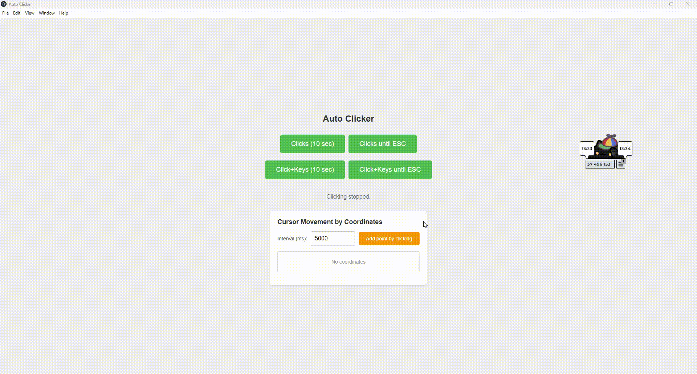

# Auto Clicker for Windows

A simple application for automatic left mouse button clicking over a specified duration. Supports two modes: clicks only and hybrid mode (click + keyboard).

Works great with [Bongo Cat](https://store.steampowered.com/app/3419430/Bongo_Cat/):

| Per minute | Per hour | Per day |
|:---:|:---:|:---:|
| ~20,000 | ~1.2 million | **25+ million** ❗ |


- **Coordinate clicking** — automatically collects chests by clicking at specified screen positions



## For Regular Users

### Requirements

- Windows 10 or later
- Internet connection only for downloading

### Quick Start

1. [Download the latest release](https://github.com/dluhhbiu/electron-auto-clicker/releases) (.exe file)
2. Run the downloaded file
3. Press the button to start
4. Move the cursor to the desired location

### Operating Modes

#### 1. Clicks Only

- Press "Clicks (10 sec)" or "Clicks until ESC"
- The application will click the left mouse button
- Each click takes ~70 ms

#### 2. Hybrid Mode (click + keyboard)

- Press "Click+Keys (10 sec)" or "Click+Keys until ESC"
- Each cycle performs: 1 click + 4 arrow key presses (up down left right) in parallel
- Suitable for games with click frequency limits

### Controls

- All buttons become disabled while running
- Press `ESC` to stop infinite modes
- All logs are displayed in the application console (F12)

### Security

The application does not require administrator privileges, does not modify system files, and does not collect any data.

---

## For Developers

### Requirements

- Node.js 16+ [download here](https://nodejs.org/)
- npm (installed with Node.js)
- Git (optional)

### Install Dependencies

```bash
npm install
```

### Run in Development Mode

```bash
npm start
```

### Build Executable

For Windows:

```bash
npm install --save-dev electron-builder
npm run build-win
```

The output file will be in the `dist/` folder.

## Architecture

- **Main Process**: main.js - manages PowerShell processes
- **Renderer Process**: index.html - user interface
- **Communication**: IPC between main and renderer processes

## License

MIT
